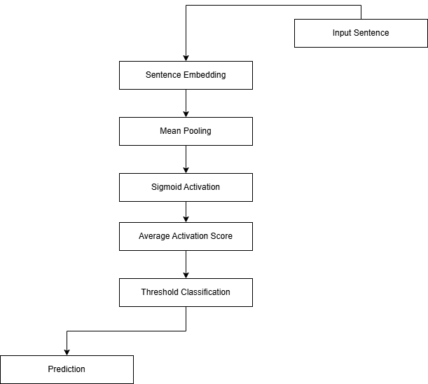

# Sentiment Classifier Report

**Custom Classifier v1**

---

## Introduction

This project presents the first iteration of a custom binary sentiment classifier that uses trainable word embeddings as its primary learned representation. The model is designed to classify movie reviews as either positive or negative while maintaining a relatively simple architecture, allowing for a deeper understanding of the underlying principles of natural language processing (NLP) and neural network-based text classification.

The model takes inspiration from the Continuous Bag of Words (CBOW) approach to word representation learning in the sense that the embedding vectors are not pre-trained; instead, they are learned during the training process. By learning distributed word representations directly from the corpus, the model is able to capture semantic information that is specific to the training data.

This method of representation learning is particularly interesting because it explores content-specific learning and demonstrates that meaningful semantic relationships can emerge from relatively simple architectures. Although this first iteration, as will be discussed later in this report, has several notable limitations, it presents an interesting perspective that warrants further investigation.

The primary objective of this project is not to reinvent the wheel, but rather to gain a deeper understanding of fundamental concepts in natural language processing and neural networks by exploring existing ideas from different perspectives and implementing them from first principles.

---

## Problem Statement

The amount of semantic information that can be extracted from a corpus is not necessarily proportional to the complexity of model architecture used. While larger and more sophisticated models have proven to perform well across many NLP tasks, simpler models are also capable of producing respectable semantic representations of these corpora.

This project seeks to investigate how much semantic information can be captured using a relatively simple sentiment classification architecture based primarily on trainable word embeddings. In addition to being a learning exercise this project also serves to provide insight into the capabilities and limitations of lightweight models and to establish a foundation on which more sophisticated iterations can be built.

---

## Dataset

The [IMDB Movie Reviews dataset](https://ai.stanford.edu/~amaas/data/sentiment/) was used to train, validate, and test the first iteration of the custom sentiment classifier and to compare its performance against a baseline sentiment classifier. This dataset was selected because it is a widely used benchmark for binary sentiment classification tasks and provides a reliable basis for evaluating model performance.

The dataset consists of movie reviews paired with sentiment labels, where each review is classified as either positive or negative. Its relatively simple structure makes it well suited for experimentation with text preprocessing techniques, representation learning, and binary classification models.

---

## Methodology

### i) Preprocessing

Preprocessing was performed using a dedicated `Preprocessor` class responsible for cleaning and vectorising the raw data, as well as partitioning the dataset into training, validation, and test sets.

The text cleaning stage uses a custom standardisation method that converts all text to lowercase and removes all special characters, with the exception of question marks (`?`) and exclamation marks (`!`). These punctuation marks were retained because they may convey additional sentiment information, such as emphasis or emotional intensity.

Following the cleaning stage, the text is vectorised using Keras' `TextVectorization` layer. The custom cleaning function is supplied to the layer through its `standardize` parameter, ensuring that the same preprocessing pipeline is applied consistently across the entire dataset.

Finally, the processed data is partitioned into training, validation, and test sets using Scikit-learn's `train_test_split` function, allowing for model training, hyperparameter tuning, and unbiased performance evaluation.

### ii) Custom Architecture v1

The core of the architecture is a `Custom_Classifier` class that encapsulates the embedding logic, loss calculation, training procedure, activation functions, classification logic, and prediction pipeline. The class is designed to work closely with an instance of the `Preprocessor` class, and several design decisions were made with this dependency in mind.

The defining characteristic of the custom architecture is that learning occurs solely through the embedded vocabulary. Initially, the embedding matrix is randomly initialised, with each word represented by a vector of dimension `k`, whose values are sampled from the interval `[-0.1, 0.1]`.

The embedding matrix can be viewed as the "memory" or "knowledge base" of the model. During training, these embeddings are updated as the model learns patterns and relationships present in the corpus, allowing the learned representations to become highly specific to the dataset.

For a given sentence, each token is replaced by its corresponding embedding vector. Mean pooling is then applied by averaging across the embeddings of all words in the sentence, producing a single fixed-length representation of the input sequence.

The pooled representation is then passed through a sigmoid activation function. The resulting output values are averaged to produce a single sentiment score. Classification is performed by applying a threshold to this score, where:

- **Score > 0.5** : Positive sentiment
- **Score ≤ 0.5** : Negative sentiment

The model is trained using Binary Cross-Entropy with Logits Loss (`BCEWithLogitsLoss`). During backpropagation, the gradient is computed as:

                 εσ(1 - σ) / N

where:
- `ε` represents the prediction error
- `σ` represents the activation output
- `N` represents the length of the current sentence

Since the embedding matrix is the only learnable parameter of the model, only the embeddings corresponding to the words present in the current sentence are updated during each training step. This selective updating mechanism allows the model to gradually refine the semantic representations of words based on the contexts in which they appear.

# **Prediction Pipeline:**

### iii) Baseline Architecture

The baseline model is implemented using Keras' Sequential API and consists of an embedding layer, a global average pooling layer, two dense layers, and a dropout layer.

The model begins by converting the input sequence into trainable word embeddings of dimension 64. The `GlobalAveragePooling1D` layer then computes the average of the embedding vectors across the sequence dimension, producing a fixed-length representation of the input sentence.

This representation is then passed to the first dense layer containing 64 neurons and using the ReLU activation function. A dropout layer with a rate of 0.2 is subsequently applied, randomly setting approximately 20% of the activations to zero during training to reduce overfitting and improve generalisation.

Finally, the output is passed to a second dense layer consisting of a single neuron with a sigmoid activation function, producing a probability score that is used to determine the predicted sentiment class.

The model is trained using the Adam optimiser and Binary Cross-Entropy loss (`binary_crossentropy`).

---

## Experimental Setup

The 2 models share the same embedding dimension size of 64, maximum sequence length of 128, train, validation and test splits, and both models were both set to train over 100 epochs.

The custom model has no early stopping mechanism, this was a design decision in order to keep the architecture simple and to allow the model to learn the most amount of semantic information over its training run. The learning rate is set to 0.2 and the rate of decay is set to 0.99. The reason for these numbers, especially the high learning rate, is attributed to the main architectural decision to make the embedded vocabulary the only learned representation.

Since the embedding matrix is the only learnable parameter of the model and is randomly initialised at the start of training, the initial representations contain little semantic information. A high learning rate therefore allows the model to rapidly explore the solution space and make substantial adjustments to the embeddings during the early stages of training, enabling it to quickly capture meaningful patterns present in the corpus.

As training progresses and the embeddings become increasingly informative, the decaying learning rate gradually reduces the magnitude of weight updates. This allows the model to transition from exploration to exploitation, refining the learned representations and improving convergence stability.

The baseline has a simple setup, it uses the Adam optimiser and Binary Cross-Entropy loss, and unlike the custom model it has an early stopping mechanism which makes training much more efficient. In terms of the learning rate, it is reduced when a plateau is detected in the validation loss. These two mechanisms resulted in the baseline model converging only after 6 epochs. The impact of these design choices is discussed in the Results section.

---

## Results

### Table 1: Evaluation Results

| Model     | Polarity | Precision | Recall | F1-Score | Accuracy |
|-----------|----------|-----------|--------|----------|----------|
| **Custom**| Positive | 0.75      | 0.77   | 0.76     | **75.83%** |
|           | Negative | 0.76      | 0.75   | 0.76     |          |
| **Baseline**| Positive | 0.86   | 0.85   | 0.86     | **85.83%** |
|           | Negative | 0.85      | 0.87   | 0.86     |          |

### Table 2: Custom Classifier Confusion Matrix

| Prediction | Negative | Positive |
|------------|----------|----------|
| **Negative** | 2811     | 939      |
| **Positive** | 874      | 2876     |

### Table 3: Baseline Classifier Confusion Matrix

| Prediction | Negative | Positive |
|------------|----------|----------|
| **Negative** | 3250     | 500      |
| **Positive** | 563      | 3187     |

---

### Analysis

The results in Table 1 show us a very clear picture of the custom model's performance in its current iteration. Compared to the baseline, it is on average 10 percentage points lower in all metrics. This result does not come as a surprise though as the baseline is a simple yet well optimised model, while the custom model is an experimental one that is only in its first version. Despite this though, it has still managed to produce respectable results, particularly with an accuracy of **75.83%** and an F1-Score of **76%**. These results indicate a very promising start as well as future for later iterations of the Custom Classifier model.

From the confusion matrices:
- The custom implementation predicted false negatives for **25.04%** of all negative labels and false positives for approximately **23.31%** of positive labels (a **1.73%** difference in false reporting)
- The baseline predicted false negatives for about **13.33%** of negative labels and false positives for about **15.01%** of positive labels (a **1.68%** difference in false reporting)
- Average false reporting: Baseline **14.17%** vs Custom **24.18%**

This reinforces the 10 percentage point lead the baseline has over the custom model but also further highlights the potential the custom model holds in future iterations.

---

## Limitations

There are several identifiable limitations with the custom model in its current iteration:

**1. Lack of Positional and Contextual Information**
The most significant limitation is its inability to retain positional and contextual information within a sequence. As a result, the model relies solely on the embeddings of the individual tokens and their averaged representation, making it difficult to capture linguistic structures such as negation, emphasis, sarcasm, satire, and other nuanced forms of expression.

**2. Performance on Short Reviews**
A notable observation during testing was that the model appeared to perform better on longer reviews than on shorter ones. Longer reviews typically contain a greater number of sentiment-bearing words, allowing the averaged embedding representation to capture stronger sentiment signals. In contrast, shorter reviews provide less information for the model to aggregate, making the loss of positional and contextual information more significant and increasing the likelihood of misclassification.

These limitations are primarily a consequence of the model's intentionally simple architecture, which employs mean pooling instead of sequence-aware techniques such as recurrent neural networks or attention mechanisms.

---

## Future Work

The development roadmap for the custom classifier has a clearly defined direction. The first iteration was intentionally designed as a simple proof of concept, with the primary objective of demonstrating that meaningful semantic representations can be learned using only trainable word embeddings. This objective was successfully achieved and provides a solid foundation for future development.

### Version 2: BiLSTM Extension
Version 2 will extend the current architecture by introducing a Bidirectional Long Short-Term Memory (BiLSTM) network. Unlike the current mean-pooling approach, a BiLSTM is capable of modelling sequential dependencies by processing a sentence in both forward and backward directions, allowing the model to capture richer contextual information.

### Version 3: Self-Attention Mechanism
Building upon this, Version 3 will incorporate a self-attention mechanism on top of the BiLSTM architecture. The attention layer will enable the model to assign greater importance to the most relevant words in a sentence, allowing it to focus on sentiment-bearing tokens while making better use of the contextual information learned by the BiLSTM.

These planned improvements aim to address the primary limitations identified in Version 1 while preserving the project's original objective of understanding and progressively improving custom neural network architectures for sentiment classification.

---

## Conclusion

This project presented the first iteration of a custom binary sentiment classifier that uses a trainable embedding matrix as its sole learned representation. A working proof of concept was successfully implemented and evaluated against a baseline binary sentiment classifier. Although the custom model did not match the performance of the baseline, it achieved respectable results while demonstrating that meaningful semantic representations can be learned using a deliberately simple architecture.

Throughout the project, the model's primary limitations were identified, along with several interesting observations regarding its behaviour during testing. These findings have informed a clear development roadmap for future iterations, with planned architectural improvements aimed at addressing the current limitations while preserving the core ideas established in Version 1.

